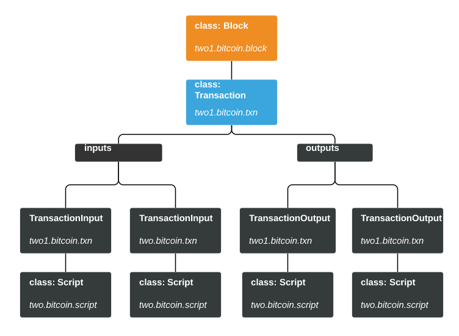
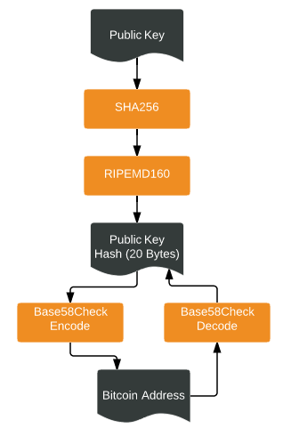

# Blocks, Transactions & Mining

Let's demonstrate the functionality of the Bitcoin library by creating a Block and mining it.

The following figure shows the object hierarchy for constructing a Bitcoin Block using the two1 package.



We can create the required objects to the construct Block in bottomup fashion. 

1. Creating transactions
2. Create a Coinbase transaction
3. Create a Block that includes the transactions from step 1 & step 2
4. Mine this Block with a low Difficulty on a CPU
5. Verify the mined block

### Building Bitcoin Transactions

1. Create the transaction input:

```python

from two1.bitcoin import txn
utxo_txn_hash = "0bf0de38c26195919179f42d475beb7a6b15258c38b57236afdd60a07eddd2cc")
txn_input = txn.TransactionInput(bytes.fromhex(utxo_txn_hash),   #UTXO Txn Hash
                                0,                       # UTXO index 
                                utxo_unlock_script,      # unlock script
                                0xFFFFFFFF #unused sequence number
                                )

```
2. Decode the Bitcoin output addresses to obtain the Public Key Hash.



```python
#Decode address
from two1.bitcoin import utils
utils.address_to_key("19cPuTdPFgyLe1rEb5tDVB56H6fhqSPBrW")
(0, b"^r\xafC2\xc4\xe3'\xcd\x92\x8d\xd0\x7f\x11\xb8x\x10V\x91'")
output1_pubkeyhash= utils.address_to_key("1EEbvSzPz3LY7t3fvWCKuWukHDvi81y2qv")

```
3. Use the Public Key Hash to create a simple lock script for the outputs

```python

from two1.bitcoin import script
output1_utxo_lock_script = script.Script("OP_DUP OP_HASH160 0x%s\
OP_EQUALVERIFY OP_CHECKSIG" % utils.bytes_to_str(output1_pubkeyhash[1]))


```
4. Create output transactions

```python
txn_output1 = txn.TransactionOutput(100000,                   # Satoshi amount
                                    output1_utxo_lock_script  # Output1 lock script
                                    )
```


### Building a Coinbase Transaction

Coinbase transactions are different from other Bitcoin transactions and are handled using the *two1.mining.coinbase* package.

```python
from two1.mining import coinbase
coinbase_builder = coinbase.CoinbaseTransactionBuilder(
                            367439,    # height 
                            iscript0, 
                            iscript1,
                            enonce1_size,    # length of enonce1 (bytes)
                            enonce2_size,    # length of enonce2 (bytes)
                            [miner_output_transaction], # outputs
                            0
                            )
```

For mining purposes, the *CoinbaseTransactionBuilder* provides an interface to generate a large number of coinbase transactions using the above template. An instance of a coinbase transaction can be created using the *build* function.

```python
enonce1 = bytes([random.randrange(0,256) for n in range(enonce1_size)])
enonce2 = bytes([random.randrange(0,256) for n in range(enonce2_size)])
coinbase_txn1 = coinbase_builder.build(enonce1, enonce2)

enonce1 = bytes([random.randrange(0,256) for n in range(enonce1_size)])
enonce2 = bytes([random.randrange(0,256) for n in range(enonce2_size)])
coinbase_txn2 = coinbase_builder.build(enonce1, enonce2)
```

### Creating a Bitcoin Block 

Now that we can build trasactions, we can create a Block object.

```python
bits_difficulty = 0x1dffffff
# Hashes must be in internal order (so block hashes have 0s on the right side)
previous_block_hash = "831f61ebaffa8dc6c8e40a0cf48dc27b94be2c4c0d45df0d0000000000000000"
previous_block_hash_bytes = utils.hex_str_to_bytes(previous_block_hash)
height = 367439
version = 3
itime = 1438151152

block_obj = block.Block(height,                 # height
                    version,                    # version
                    previous_block_hash_bytes,  # prev block hash
                    itime,                      # time
                    bits_difficulty,            # bits
                    0,                          # nonce
                    [coinbase_txn, txn1, txn2 ...], # transactions
                    )
```

The Merkle tree for the Block is computed upon creation. However, if any changes are made to the transactions in a block, a recomputation of the merkle tree must be manually triggered:

```python

block.invalidate()
print("Block Header %s " % utils.bytes_to_str(block.hash))

```

### Mining a Bitcoin Block

In order to efficiently represent a Block for mining purposes, the *bitcoin* modules provides a class called *CompactBlock*. This class stores only stores the merkle edge (instead of the entire merkle tree) from the coinbase transaction leading up to the root of the merkle tree. 

```python
from two1.bitcoin import block
merkle_edge = block_obj.get_merkle_edge()
# Create a CompactBlock 
compact_block = block.CompactBlock(height,                    
                                   version,                   
                                   previous_block_hash_bytes, 
                                   itime,                     
                                   bits_difficulty,           
                                   merkle_edge,               
                                   coinbase_txn)
```

Typical mining process is to look for a *nonce* value that solves a Block. Once, a valid nonce has been found, the *CompactBlock* provides a builtin function to verify the solution.

```python
## Check if a nonce solves this block
print("Valid Nonce? %g " % compact_block.check_valid_nonce(0x0))
```
